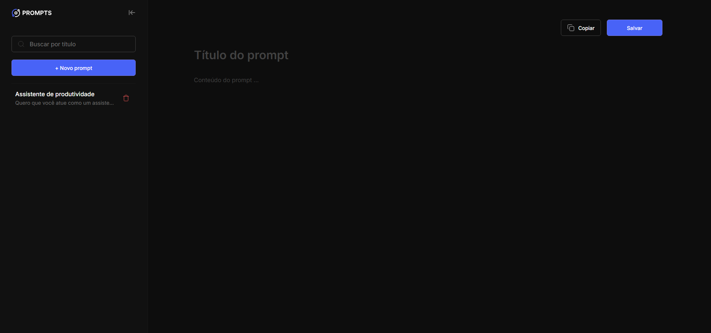

# 🤖 Prompt Manager
✨ Organize, Crie e Gerencie Seus Prompts de IA de Forma Eficiente

[]

<div align="center">
  
</div>

---

## 🚀 Sobre o Projeto
> 💡 **Nota:** Este projeto foi desenvolvido a partir do evento **NLW Pocket** (Next Level Week Pocket), oferecido pela <a href="https://rocketseat.com.br/" target=_blank>[**Rocketseat**]</a>.

O **Prompt Manager** é uma aplicação web prática e intuitiva projetada para ser o seu **hub central de produtividade em Inteligência Artificial**. Chega de perder prompts valiosos em notas ou documentos dispersos!

Com ele, você pode:
* **Criar e Salvar** novos prompts (título e conteúdo).
* **Organizar** seus prompts em uma lista lateral.
* **Buscar** prompts rapidamente por título.
* **Copiar** o conteúdo do prompt com um único clique, pronto para ser colado em qualquer IA (ChatGPT, Gemini, Midjourney, etc.).
* **Deletar** prompts com confirmação visual (UX aprimorada com modal customizada).
* **Acessar** o aplicativo em dispositivos móveis (design responsivo).

---

## 💡 Tecnologias Utilizadas

Este projeto foi desenvolvido utilizando uma stack leve e moderna para performance e reatividade.

| Categoria | Tecnologia | Descrição |
| :--- | :--- | :--- |
| **Estrutura** | **HTML5** | Estruturação semântica do conteúdo. |
| **Estilização** | **CSS3** | Layout moderno, variáveis CSS (`:root`) e design responsivo (`@media queries`). |
| **Funcionalidade** | **JavaScript (ES6+)** | Lógica de aplicação, manipulação do DOM e persistência de dados. |
| **Controle de Versão** | **Git** | Sistema de controle de versão distribuído, essencial para o desenvolvimento e colaboração no GitHub. |
| **Persistência** | **`localStorage`** | Armazenamento local dos prompts, garantindo que seus dados permaneçam salvos no navegador. |
| **Design** | **Figma** | Criação e prototipagem da interface do usuário. |
| **Integração IA** | **IA MCP server** | (Mencionado na lista original, ajustar a descrição se for uma ferramenta interna/específica) |

---

## ⚙️ Funcionalidades e Boas Práticas

Durante o desenvolvimento, priorizei a aplicação das seguintes boas práticas de engenharia de software:

* **Modularização do JS:** Utilização de objetos `state` e `elements` para gerenciamento limpo de dados e do DOM.
* **Controle de Estado:** Persistência de dados através do `localStorage` com funções dedicadas (`load`, `persist`).
* **UX Aprimorada:** Substituição do `confirm()` nativo por uma **Modal de Confirmação** customizada em HTML/CSS para uma experiência mais coesa e visualmente agradável.
* **Performance:** Uso de `event delegation` no listener da lista de prompts para gerenciar as ações de seleção e remoção de forma eficiente.
* **Design Tokens:** Uso de variáveis CSS (`:root`) para cores, facilitando futuras manutenções e consistência visual.

---

## 🛠️ Como Executar o Projeto

É muito fácil rodar o Prompt Manager na sua máquina:

1.  **Clone o repositório:**
    ```bash
    git clone [https://github.com/brunogrimes/Prompt-Manager-NLW.git](https://github.com/brunogrimes/Prompt-Manager-NLW.git)
    ```
2.  **Entre na pasta do projeto:**
    ```bash
    cd prompt-manager
    ```
3.  **Abra o arquivo:**
    Simplesmente abra o arquivo `index.html` em seu navegador. Como o projeto utiliza apenas JavaScript *client-side* e `localStorage`, não é necessário um servidor local.

---

## 🤝 Contribuição

Contribuições, sugestões ou *pull requests* são muito bem-vindos! Se você encontrar um bug ou tiver uma ideia de melhoria, sinta-se à vontade para abrir uma *issue*.

---

Feito com ❤️ e ☕